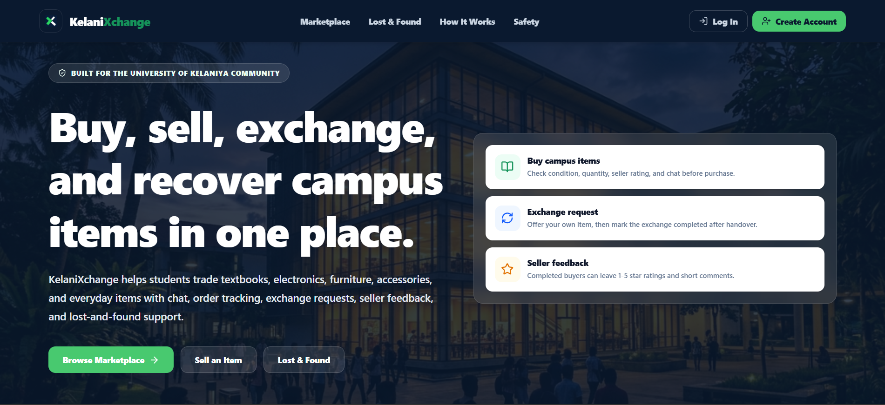
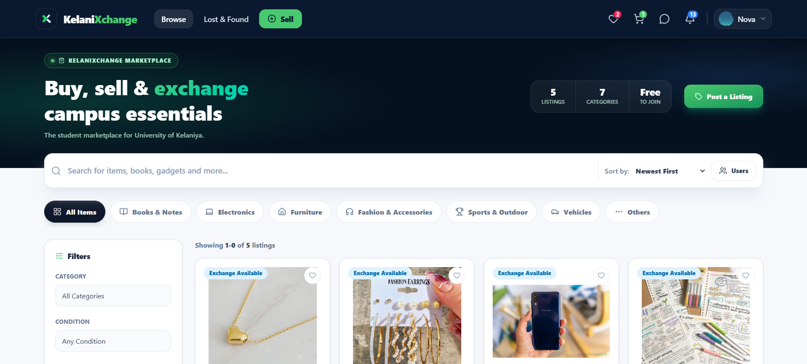
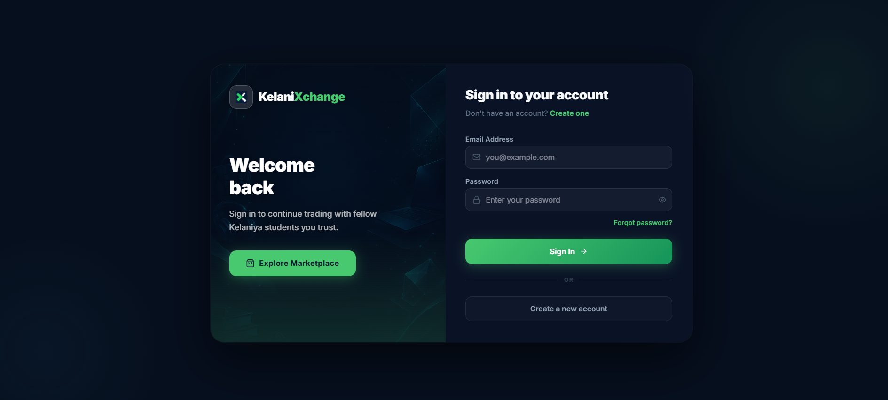

# KelaniXchange

A **Student Peer-to-Peer Marketplace** built for university students to buy, sell, exchange items, and report lost & found objects — all within their campus community.

---

## Tech Stack

| Layer | Technology |
|-------|-----------|
| Frontend | React 19, Vite, Tailwind CSS v4 |
| State Management | Redux Toolkit |
| Backend | Node.js, Express 5 |
| Database | MongoDB Atlas (Mongoose) |
| Real-time | Socket.IO |
| Auth | JWT + bcryptjs |
| File Uploads | Cloudinary + Multer |
| Containerization | Docker + Docker Compose |

---

## Screenshots

### Home


### Marketplace


### Login


---

## Features

- **Marketplace** — List, browse, and purchase items
- **Exchange** — Propose and manage item-for-item exchanges
- **Orders** — Track buying and selling activity
- **Lost & Found** — Report and search for lost items
- **Real-time Chat** — Message other users via Socket.IO
- **Notifications** — Live in-app notifications
- **Wishlist** — Save favourite listings
- **Reviews** — Rate and review other users
- **Admin Panel** — Manage users, listings, and reports

---

## Getting Started

### Prerequisites

- [Node.js 20+](https://nodejs.org)
- [Docker Desktop](https://www.docker.com/products/docker-desktop) *(for Docker setup)*

---

### Option 1 — Run with Docker (Recommended)

> Make sure Docker Desktop is running before proceeding.

**1. Clone the repository**
```bash
git clone https://github.com/your-username/KelaniXchange.git
cd KelaniXchange
```

**2. Set up environment variables**
```bash
cp server/.env.example server/.env
# Fill in your real values in server/.env
```

**3. Build and start all services**
```bash
docker compose up --build
```

**4. Open the app**

| Service | URL |
|---------|-----|
| Frontend | http://localhost:3000 |
| Backend API | http://localhost:5000 |

**Stop the app**
```bash
docker compose down
```

---

### Option 2 — Run Locally (Development)

**1. Install dependencies**
```bash
# Server
cd server
npm install

# Client
cd ../client
npm install
```

**2. Set up environment variables**
```bash
cp server/.env.example server/.env
# Fill in your real values in server/.env
```

**3. Start the development servers**

In one terminal:
```bash
cd server
npm run dev
```

In another terminal:
```bash
cd client
npm run dev
```

**4. Open the app**

| Service | URL |
|---------|-----|
| Frontend | http://localhost:5173 |
| Backend API | http://localhost:5000 |

---

## Environment Variables

Copy `server/.env.example` to `server/.env` and fill in the values:

| Variable | Description |
|----------|-------------|
| `PORT` | Server port (default: `5000`) |
| `MONGO_URI` | MongoDB Atlas connection string |
| `JWT_SECRET` | Secret key for signing JWTs |
| `CLOUDINARY_CLOUD_NAME` | Cloudinary cloud name |
| `CLOUDINARY_API_KEY` | Cloudinary API key |
| `CLOUDINARY_API_SECRET` | Cloudinary API secret |
| `CLIENT_URL` | Frontend URL (for CORS) |
| `API_PUBLIC_URL` | Backend public URL |

---

## Project Structure

```
KelaniXchange/
├── client/                  # React + Vite frontend
│   ├── src/
│   │   ├── pages/           # Route-level page components
│   │   ├── components/      # Reusable UI components
│   │   └── store/           # Redux slices & store
│   ├── Dockerfile
│   └── nginx.conf
│
├── server/                  # Express backend
│   ├── src/
│   │   ├── controllers/     # Route handlers
│   │   ├── models/          # Mongoose schemas
│   │   ├── routes/          # API route definitions
│   │   ├── middleware/       # Auth & other middleware
│   │   ├── services/        # Business logic
│   │   └── sockets/         # Socket.IO handlers
│   ├── Dockerfile
│   └── .env.example
│
└── docker-compose.yml
```

---

## License

[MIT](LICENSE)
